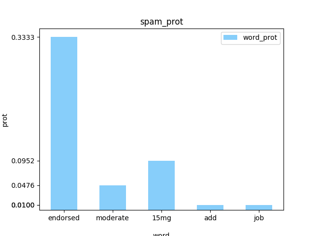

# Navie Bayes

### 文件说明
1. email:数据分为ham和spam，25封邮件
2. test:为空，等分出训练集和测试集后使用
3. [Navie_Bayes.py](Navie_Bayes.py) 训练模型，测试数据
4. [prepare_data.py](prepare_data.py) 数据预处理
### 伪代码

1. 数据预处理

2. 计算单词概率

3. 训练模型

4. 测试模型准确度

### 代码执行流程

1. 首先执行[prepare_data.py](prepare_data.py)  :进行训练数据和测试数据的选择
2. 然后执行 [Navie_Bayes.py](Navie_Bayes.py) :进行模型的训练，测试
3. 生成：标识垃垃圾单词出现的频率

